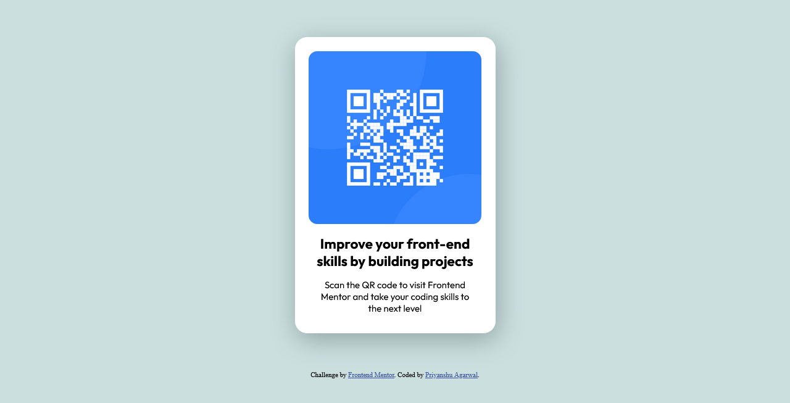

# Frontend Mentor - QR code component solution

This is a solution to the [QR code component challenge on Frontend Mentor](https://www.frontendmentor.io/challenges/qr-code-component-iux_sIO_H). Frontend Mentor challenges help you improve your coding skills by building realistic projects. 

## Table of contents

- [Overview](#overview)
  - [Screenshot](#screenshot)
  - [Links](#links)
- [My process](#my-process)
  - [Built with](#built-with)
  - [What I learned](#what-i-learned)
  - [Continued development](#continued-development)
- [Author](#author)

## overview

### Screenshot

### Links

- Live Site URL: [Frontend Mentor - QR code component solution](https://62cc1e71cd4d760670f078d3--qr-code-component4206.netlify.app/)

### Built with

- Semantic HTML5 markup
- CSS custom properties
- Flexbox

### What I learned

Working with this project made me realize what's the true meaning of learning by working.
While working on this project I learned concepts like :-

-dividing and conquer technique
-Flexbox properties 
-box-shadow's properties

### Continued development

While working with images properties and adjusting the width and height properties of it for being resposive is one part of skill I really need to work upon.
This time I even leaned how to add shadow to a div box and several tweaks we can do to it.
## Author

- Website - [Frontend Mentor | QR code component solution](https://62cc1e71cd4d760670f078d3--qr-code-component4206.netlify.app/)
- Frontend Mentor - [@Priyanshu4206](https://www.frontendmentor.io/profile/Priyanshu4206)
